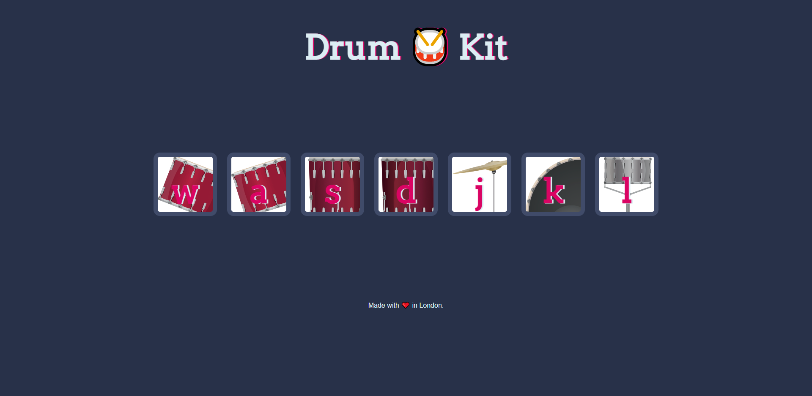

## Overview

## Table of contents

- [Overview](#overview)
  - [The project](#the-project)
  - [Screenshot](#screenshot)
  - [Links](#links)
- [My process](#my-process)
  - [Built with](#built-with)
  - [What I learned](#what-i-learned)
  - [Continued development](#continued-development)

### The project

- The aim of this project was to create an interactive drumkit where the user could either press the corresponding keys on their keyboard or click on the
buttons manually to play the relevent drum sounds.

### Screenshot



### Links

- Live Site URL: 

## My process

### Built with

- Semantic HTML5 markup
- CSS custom properties
- JavaScript ES6

### What I learned

- Selecting every iteration of something with vanilla JavaScript

```js
let numberOfDrums = document.querySelectorAll(".drum").length;

for (i = 0; i < numberOfDrums; i++) {

  document.querySelectorAll("button")[i].addEventListener("click", function() {}
```

- Using keydown and on-click event listeners

```js
document.addEventListener("keydown",function(){

  makeSound(event.key);

  buttonAnimation(event.key);

});

document.querySelectorAll("button")[i].addEventListener("click", function() {

  let buttonInnerHTML = this.innerHTML;

  makeSound(buttonInnerHTML);

  buttonAnimation(buttonInnerHTML);

});
```

- What an anonymous function is and how to call other functions using one

```js
document.addEventListener("keydown",function(){

  makeSound(event.key);

  buttonAnimation(event.key);

});
```

- Switch statements and how to play audio

```js
function makeSound(key) {
  switch (key) {
    case "w":
      var tom1 = new Audio("sounds/tom-1.mp3");
      tom1.play();
      break;
    case "a":
      var tom2 = new Audio("sounds/tom-2.mp3");
      tom2.play();
      break;
    case "s":
      var tom3 = new Audio("sounds/tom-3.mp3");
      tom3.play();
      break;
    case "d":
      var tom4 = new Audio("sounds/tom-4.mp3");
      tom4.play();
      break;
    case "j":
      var crash = new Audio("sounds/crash.mp3");
      crash.play();
      break;
    case "k":
      var kick = new Audio("sounds/kick-bass.mp3");
      kick.play();
      break;
    case "l":
      var snare = new Audio("sounds/snare.mp3");
      snare.play();
      break;

    default:
      console.log("An unspecified button was pressed");

  }
}
```

- How to add an animation and also timeout the animation after an elapsed period of time

```js
function buttonAnimation (pressedKey){

  var activeKey = document.querySelector("." + pressedKey);

  activeKey.classList.add("pressed");

  setTimeout (function(){
    activeKey.classList.remove("pressed");
  },100);

}
```


### Continued development

- I plan to practice all of the concepts that I learned in the making of this project in order to enforce the knowledge so I can better implement it in 
future projects


